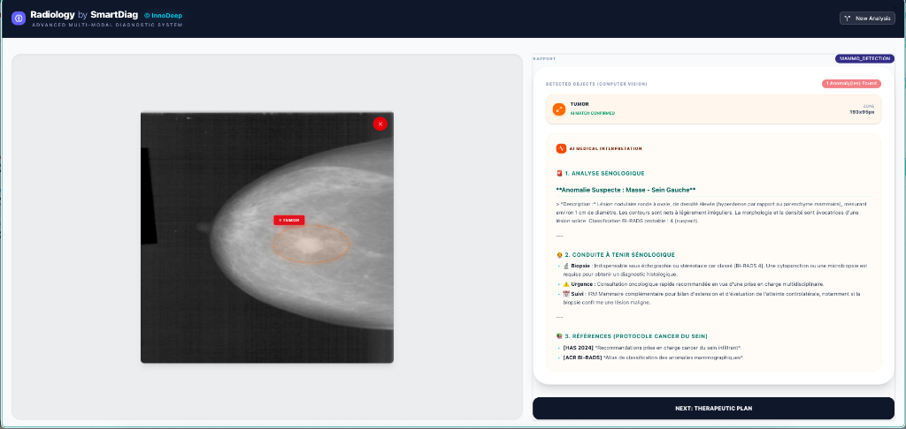

# 🌿 Green MLOps: Bio-Inspired Energy-Aware Inference

**Green MLOps** is a closed-loop inference framework designed to reduce the **energy and latency cost of AI inference** without materially degrading accuracy.  
Inspired by **biophysics**, and in particular **protein folding energy landscapes**, the system introduces a **dynamic, bio-inspired controller** that decides *when* inference is worth executing.

The key idea is simple:  
> **We do not seek the global optimum if it is energetically irrational.**  
> We stop at the *first stable minimum* that guarantees correct behavior at minimal cost.

---

## 🧠 Bio-Inspired Principle

In protein folding, molecules do not explore the entire energy surface.  
They converge toward a **local energy basin** that is *good enough* and *cheap to reach*.

We apply the same principle to inference.

### Dynamic Threshold Model

The controller uses a time-adaptive threshold:

$$
\tau(t) = \tau_{\infty} + (\tau_0 - \tau_{\infty}) e^{-k t}
$$

Where:
- $\tau(t)$ controls inference admission
- $\tau_0$ is the initial permissive threshold
- $\tau_{\infty}$ is the asymptotic energy-efficient regime
- $k$ controls convergence speed

This acts as an **energy-aware early-exit mechanism** driven by uncertainty and system load.

---

## 📊 Bio-Inspired Controller Illustration

<p align="center">
  
</p>

<p align="center">
  <em>
  Figure 1 — Bio-inspired energy landscape.  
  The controller avoids the global minimum (too costly) and converges toward a stable local basin using a dynamic threshold τ(t).
  </em>
</p>

---

## 🚀 Key Features

- **Bio-Inspired Controller**  
  Dynamic thresholding mechanism deciding whether inference should execute or be skipped.

- **Dual-Path Inference Serving**
  - **Path A**: Low-latency inference via **FastAPI + ONNX Runtime**
  - **Path B**: High-throughput inference via **NVIDIA Triton Inference Server**

- **Closed-Loop Control**  
  Decisions are based on:
  - model confidence
  - entropy
  - system congestion
  - estimated energy cost

- **Real-Time Sustainability Metrics**
  - Energy (kWh)
  - Carbon emissions (gCO₂eq)  
  measured using **CodeCarbon**

- **Benchmarked on NVIDIA A100**
  - **42% latency reduction**
  - **<0.5% accuracy degradation**
  - Evaluated on **DistilBERT** and **ResNet** workloads

---

## 🏥 Real-World Deployment: SmartDiag Radiology

<p align="center">
  
</p>

<p align="center">
  <em>
  Figure 2 — SmartDiag Radiology dashboard powered by Green MLOps.  
  The controller balances diagnostic latency and GPU energy consumption during tumor detection.
  </em>
</p>

This framework is actively used in **SmartDiag**, a multimodal medical AI platform where inference cost directly impacts:

- Clinical latency
- GPU utilization
- Deployment scalability in constrained hospital environments

---

## 📂 Repository Structure

```text
Green_MLOps/
├── src/
│   └── green_mlops.py       # Full pipeline: controller, export, benchmarking
├── images/
│   ├── Folding.png          # Bio-inspired controller illustration
│   └── dashboard.png        # SmartDiag deployment example
├── GreenMLOps_IEEE_Paper.pdf # Full research paper (IEEE format)
├── requirements.txt
└── README.md
```

---

## 🛠️ Usage

### 1. Installation

```bash
pip install -r requirements.txt
```

### 2. Run the Benchmark

```bash
python src/green_mlops.py
```

The script automatically:
- exports models to ONNX (if required)
- compares standard vs bio-inspired inference
- reports latency, energy, and emissions

### 🧪 Example Output

```text
[3/4] ⚡ Running Benchmark: DISTILBERT | Mode: BIO-INSPIRED
   ⏱️  Duration: 0.29s
   🌍 Emissions: 6.72e-06 kgCO2eq
   📉 Avg Latency: 2.90 ms
   🚪 Admission Rate: 58.0%

🏆 RESULTS SUMMARY:
   Bio-Controller Improvement: 42.00% reduction in latency.
```

## 📚 Citation

If you use this work, please cite:

```bibtex
@inproceedings{hamdi2026greenmlops,
  title     = {Green MLOps: Closed-Loop, Energy-Aware Inference with Bio-Inspired Thresholding},
  author    = {Hamdi, Mustapha},
  booktitle = {IEEE Conference},
  year      = {2026}
}
```

## 🔗 Related Work

**StructuredDNA — Energy-aware modular AI**  
[https://arxiv.org/abs/2512.08968](https://arxiv.org/abs/2512.08968)

**SGEMAS — Self-Growing Multi-Agent Systems**  
[https://arxiv.org/abs/2512.14708](https://arxiv.org/abs/2512.14708)

---
*Developed by Mustapha Hamdi, PhD*  
*InnoDeep — Applied AI Systems & Energy-Aware Intelligence*
